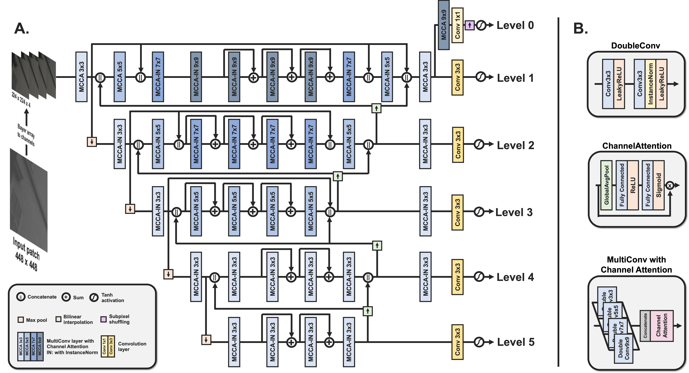

# Team *skyb* solution for the AIM2020 mobile image signal processing challenge


## How-to
Reproduce the final results:

1. Download the [pre-trained model](https://www.dropbox.com/s/psoz0auaynu3e5x/pretrained_model.zip?dl=0) and extract it in the git path
2. Run the following code with path_to_images indicating RAW images to process (add --perceptual flag for perceptual track results)

  ```shell
  python main.py --skip_train --test_dir path_to_images
  python main.py --skip_train --test_dir path_to_images --perceptual
  ```

3. Resolved images can be found at path_to_images + '\_enhanced'

Train from scratch:

1. Download the ZRR training dataset and extract it in the data/ folder within the git path
2. Run the following code.

  ```shell
  python main.py
  ```

  Command-line options can be listed by running the main script with -h flag.

  ```shell
  python main.py -h
  ```


## Requirements
- python 3.6
- pytorch >= 1.5.0
- tensorboard
- pytorch-msssim
- IQA-pytorch
- tqdm


## Concept
PyNet-CA: Enhanced [PyNet](http://people.ee.ethz.ch/~ihnatova/pynet.html) with Channel Attention for Mobile ISP




## Contact
<egyptdj@kaist.ac.kr>
